# Forensic Egyptology Audit Report

## Scope

Representative case from local source manifest. Observations and reconstructions are intentionally empty until manual annotation is provided.

## Neith pyramid, Utterance 59A, Nt 304

Hand-copy only on Faulkner page 10.

### Line: Nt 304 (Utt. 59A) hand copy

Provisional mapping: auto-sliced plate bands aligned by line order, not content-matched. Sethe 1908 page 26 includes Spruch 58-63; precise line-to-utterance alignment unverified. Sethe 1908 p26 Spruch 58-63 band auto-sliced; content alignment unverified.

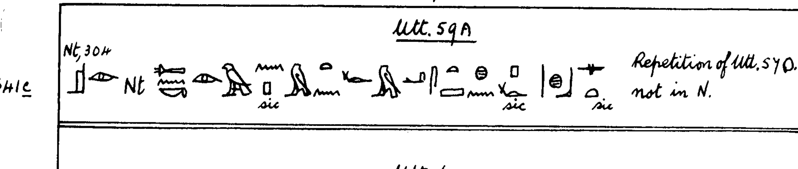

**Secondary evidence (uncertain mapping):**

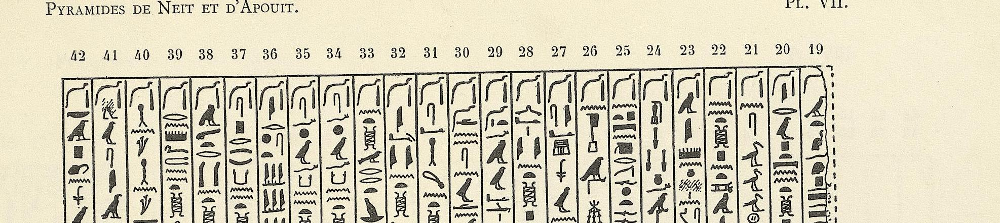

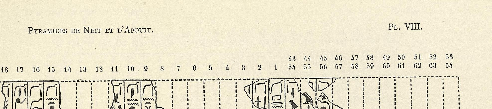

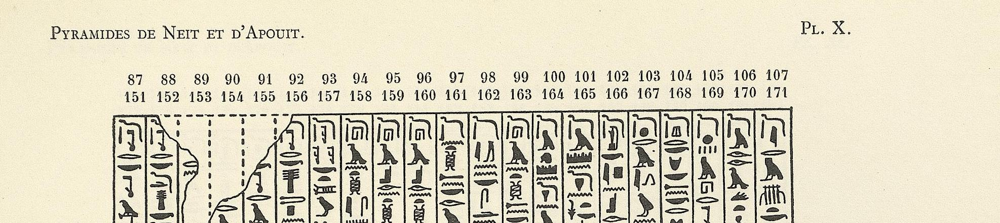

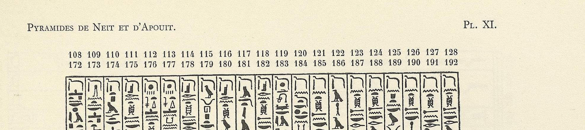

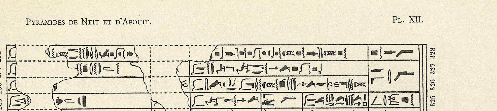

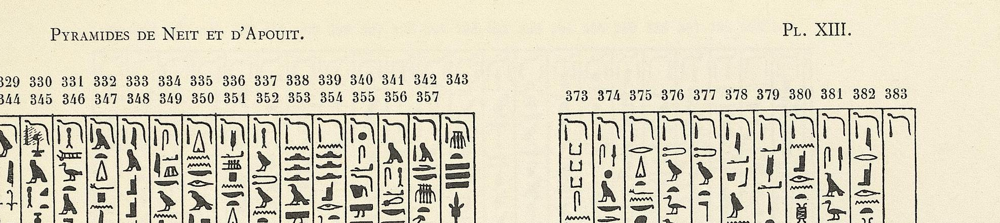

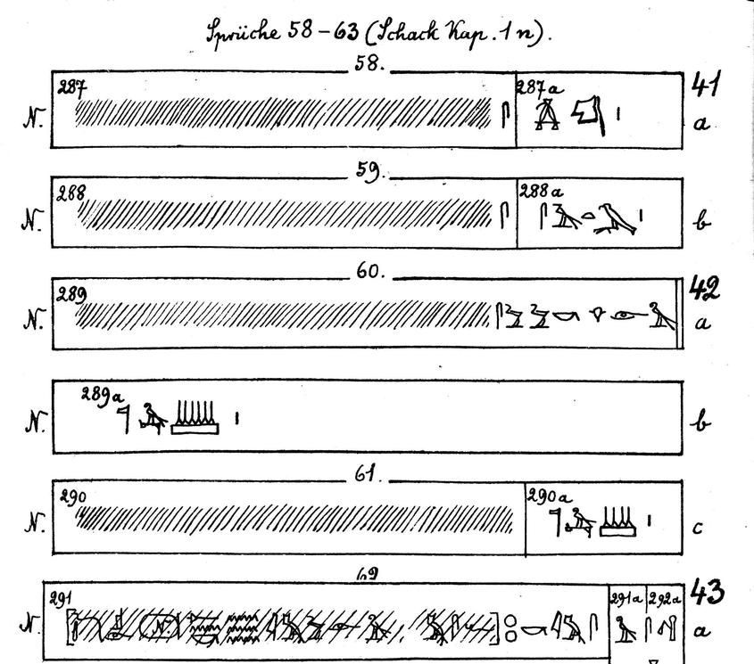

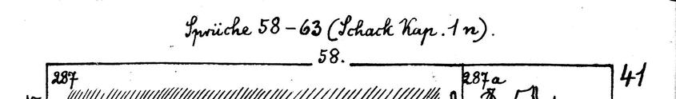

**Observation status:** Auto-annotated clusters 57 (manual review required).

**Cluster contact sheet:**

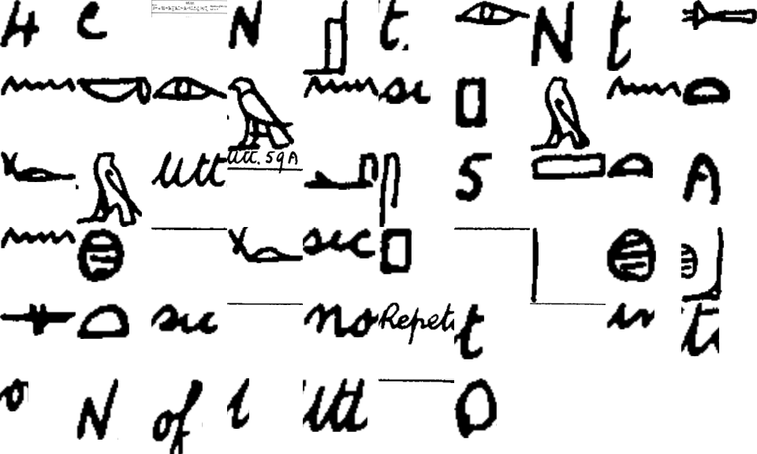

**Prior readings:**

- handcopy_reference: sethe1908_eos/sethe1908_p26 p.26
  notes: Sethe 1908 p26 labels Spruch 59 within Spruche 58-63; line-level transliteration not extracted.
- translation: mercer1952_sacred_texts/mercer1952_utt58_71 p.41
  text: O Nephthys, she comes with the gods of the South, she comes with the gods of the North, she comes with the gods of the West, she comes with the gods of the East, to the King.
  notes: Mercer translation, Utterance 59 line 41c (Nt. 304), via sacred-texts.com/egy/pyt/pyt05.htm.

**Reconstruction status:** No candidate readings generated without observations.

**Discrepancies:** None computed (no observed tokens).

## Neith pyramid, Utterance 60, Nt 305

Hand-copy only on Faulkner page 10.

### Line: Nt 305 (Utt. 60) hand copy

Provisional mapping: auto-sliced plate bands aligned by line order, not content-matched. Sethe 1908 page 26 includes Spruch 58-63; precise line-to-utterance alignment unverified. Sethe 1908 p26 Spruch 58-63 band auto-sliced; content alignment unverified.

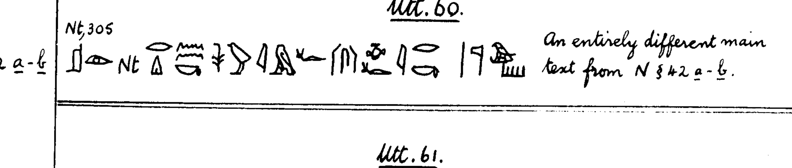

**Secondary evidence (uncertain mapping):**

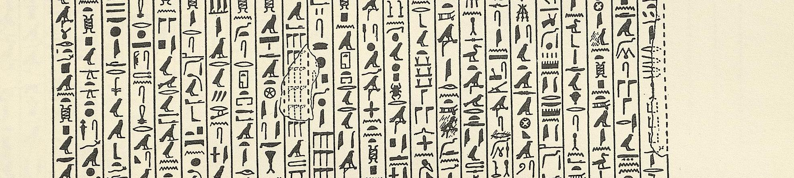

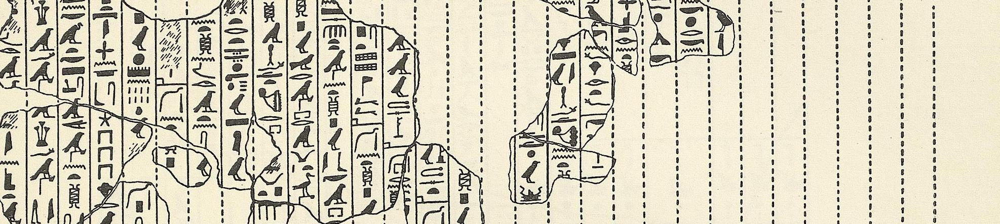

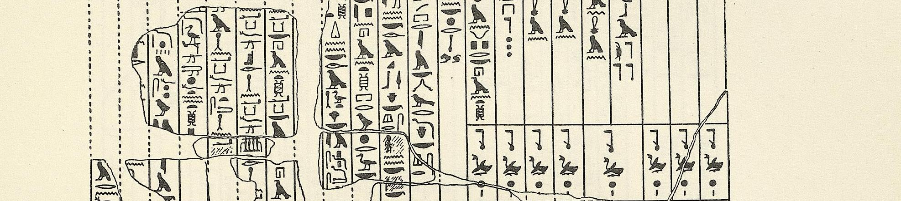

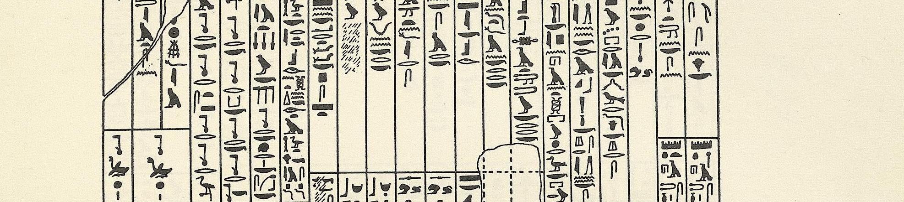

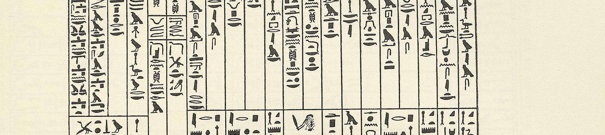

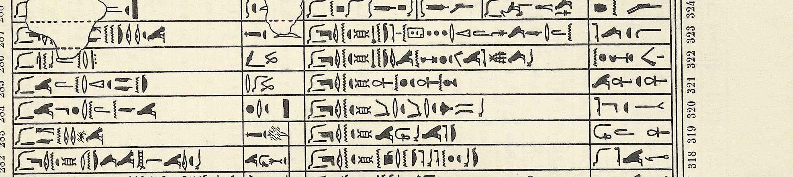

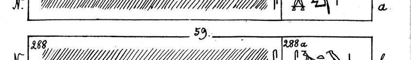

**Journal entries:**

- hypothesis: Possible sign confusion between owl and falcon in Nt305. (confidence 0.3; tags: sign_confusion, review)

**Observation status:** Auto-annotated clusters 62 (manual review required).

**Cluster contact sheet:**

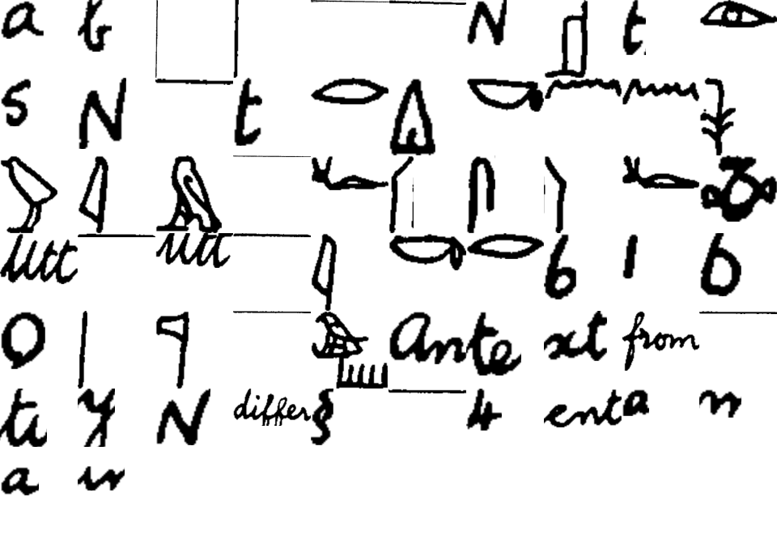

**Prior readings:**

- handcopy_reference: sethe1908_eos/sethe1908_p26 p.26
  notes: Sethe 1908 p26 labels Spruch 60 within Spruche 58-63; line-level transliteration not extracted.
- translation: mercer1952_sacred_texts/mercer1952_utt58_71 p.42
  text: O King, your father Atum comes to you, etc. / O King, your mother Nut comes to you, etc.
  notes: Mercer translation, Utterance 60 lines 42a-42b (Nt. 305), via sacred-texts.com/egy/pyt/pyt05.htm; mapping to single line is approximate.

**Reconstruction status:** No candidate readings generated without observations.

**Discrepancies:** None computed (no observed tokens).

## Neith pyramid, Utterance 61, Nt 306

Hand-copy only on Faulkner page 10.

### Line: Nt 306 (Utt. 61) hand copy

Provisional mapping: auto-sliced plate bands aligned by line order, not content-matched. Sethe 1908 page 26 includes Spruch 58-63; precise line-to-utterance alignment unverified. Sethe 1908 p26 Spruch 58-63 band auto-sliced; content alignment unverified.

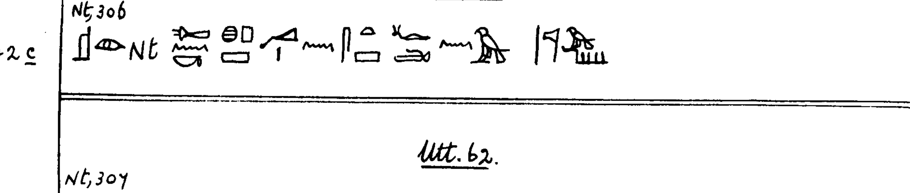

**Secondary evidence (uncertain mapping):**

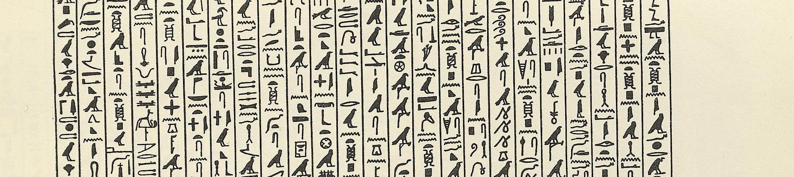

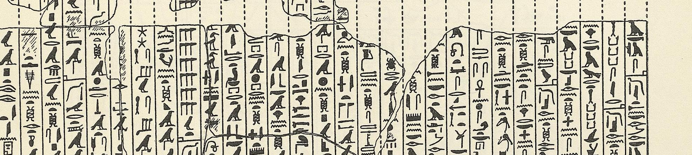

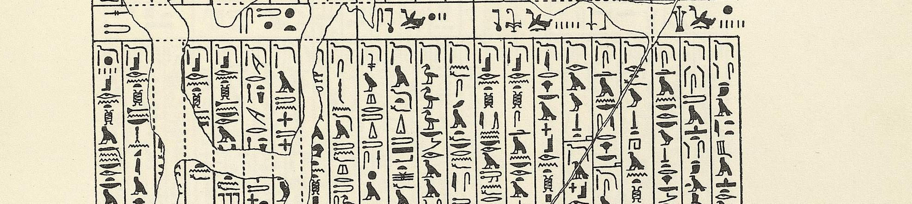

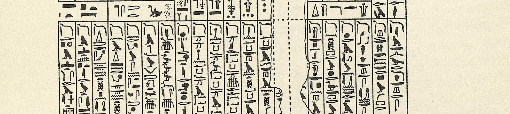

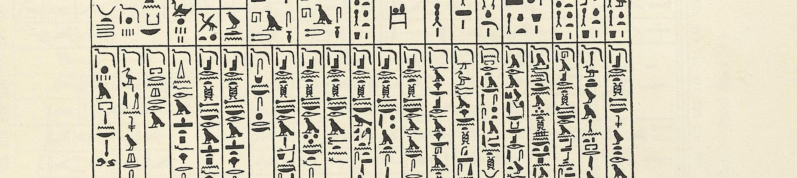

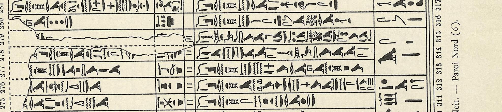

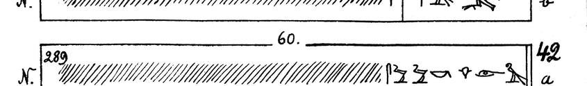

**Observation status:** Auto-annotated clusters 45 (manual review required).

**Cluster contact sheet:**

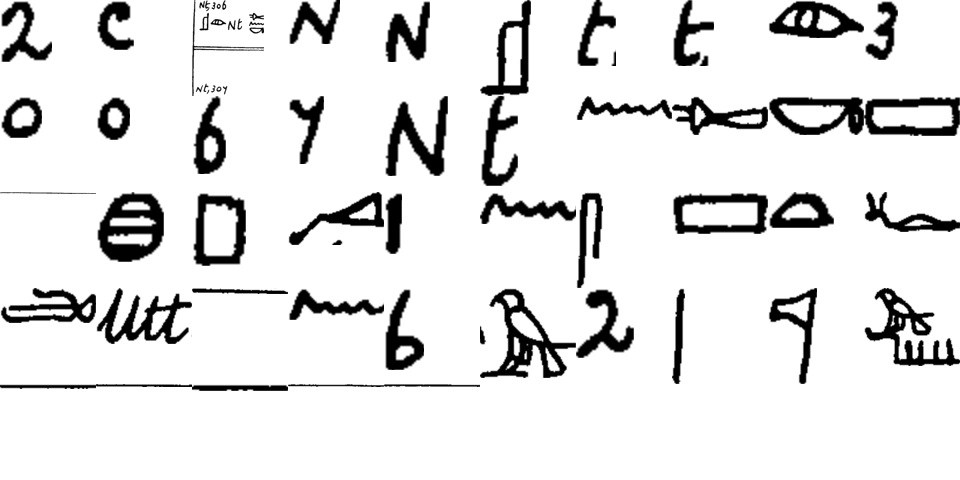

**Prior readings:**

- handcopy_reference: sethe1908_eos/sethe1908_p26 p.26
  notes: Sethe 1908 p26 labels Spruch 61 within Spruche 58-63; line-level transliteration not extracted.
- translation: mercer1952_sacred_texts/mercer1952_utt58_71 p.42
  text: O King, Atum has brought to you your kas, etc.
  notes: Mercer translation, Utterance 61 line 42c (Nt. 306), via sacred-texts.com/egy/pyt/pyt05.htm.

**Reconstruction status:** No candidate readings generated without observations.

**Discrepancies:** None computed (no observed tokens).

## Neith pyramid, Utterance 62, Nt 307

Hand-copy only on Faulkner page 10.

### Line: Nt 307 (Utt. 62) hand copy

Provisional mapping: auto-sliced plate bands aligned by line order, not content-matched. Sethe 1908 page 26 includes Spruch 58-63; precise line-to-utterance alignment unverified. Sethe 1908 p26 Spruch 58-63 band auto-sliced; content alignment unverified.

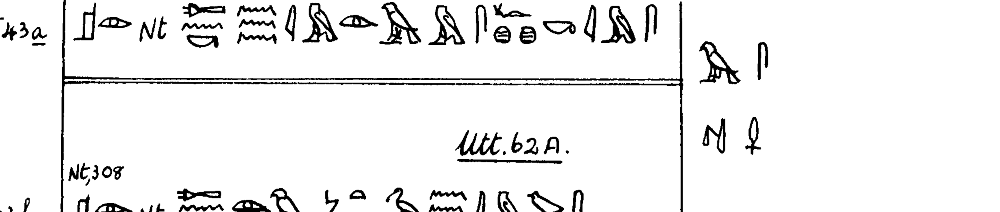

**Secondary evidence (uncertain mapping):**

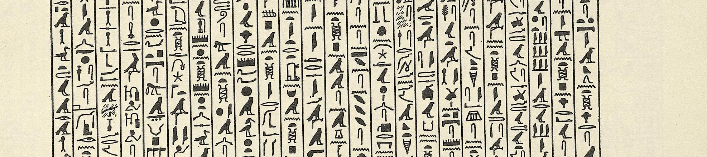

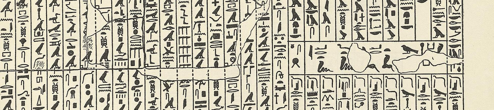

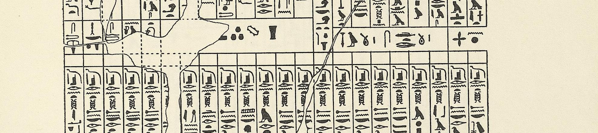

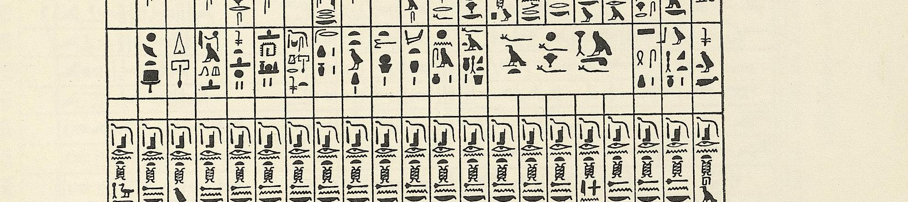

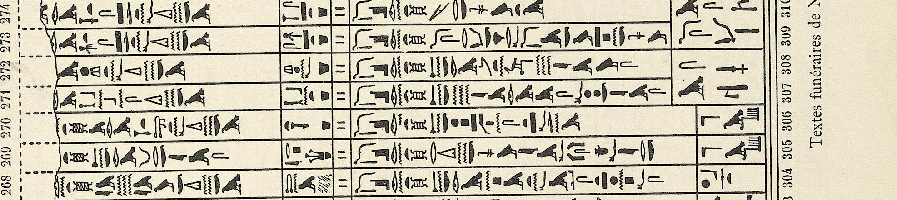

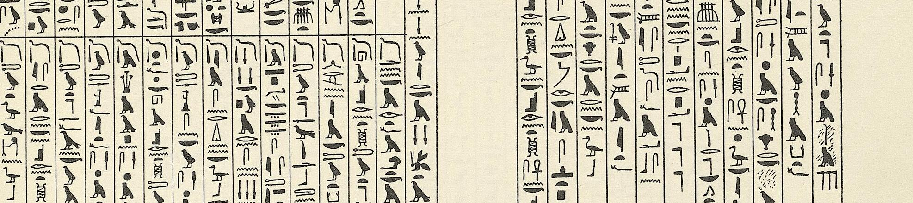

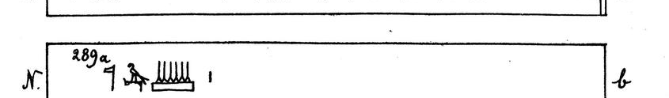

**Observation status:** Auto-annotated clusters 60 (manual review required).

**Cluster contact sheet:**

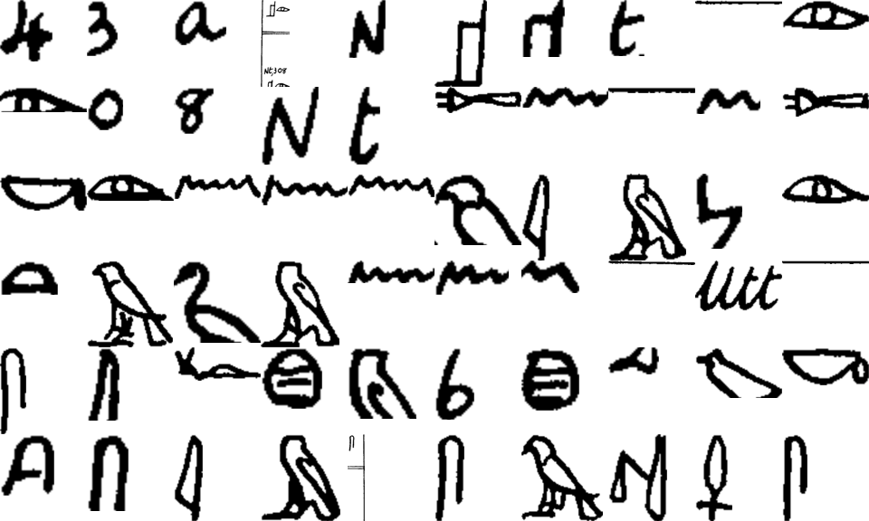

**Prior readings:**

- handcopy_reference: sethe1908_eos/sethe1908_p26 p.26
  notes: Sethe 1908 p26 labels Spruch 62 within Spruche 58-63; line-level transliteration not extracted.
- translation: mercer1952_sacred_texts/mercer1952_utt58_71 p.43
  text: O King, your father comes to you; O King, your father comes to you; O King, your father comes to you.
  notes: Mercer translation, Utterance 62 line 43a (Nt. 307), via sacred-texts.com/egy/pyt/pyt05.htm.

**Reconstruction status:** No candidate readings generated without observations.

**Discrepancies:** None computed (no observed tokens).

## Neith pyramid, Utterance 62A, Nt 308

Hand-copy only on Faulkner page 10.

### Line: Nt 308 (Utt. 62A) hand copy

Provisional mapping: auto-sliced plate bands aligned by line order, not content-matched. Sethe 1908 page 26 includes Spruch 58-63; precise line-to-utterance alignment unverified. Sethe 1908 p26 Spruch 58-63 band auto-sliced; content alignment unverified.

**Secondary evidence (uncertain mapping):**

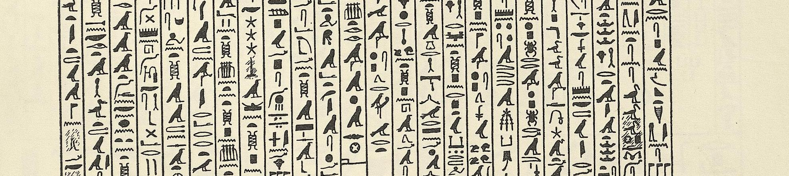

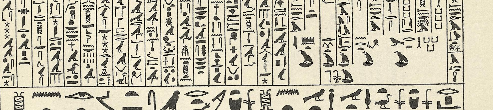

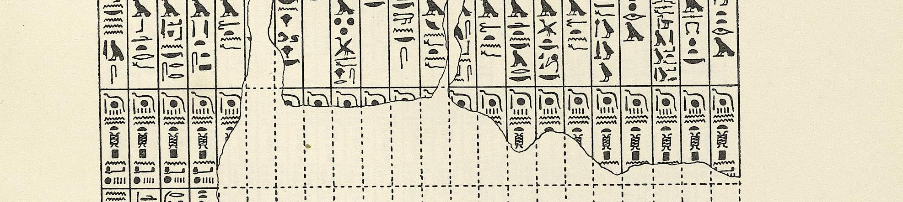

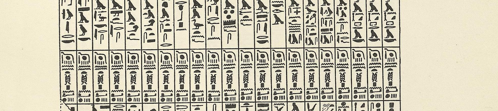

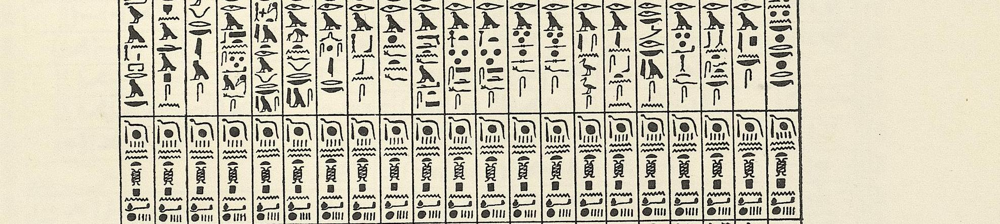

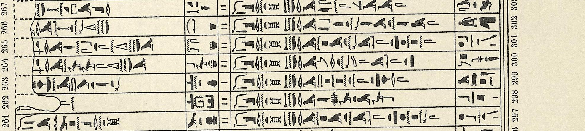

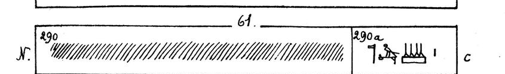

**Observation status:** Auto-annotated clusters 34 (manual review required).

**Cluster contact sheet:**

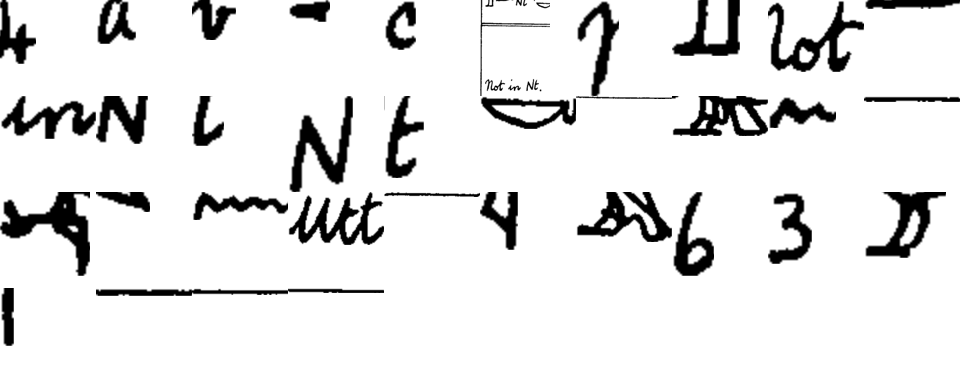

**Prior readings:**

- handcopy_reference: sethe1908_eos/sethe1908_p26 p.26
  notes: Sethe 1908 p26 labels Spruch 63 within Spruche 58-63; line-level transliteration not extracted.
- translation: mercer1952_sacred_texts/mercer1952_utt58_71 p.43
  text: O King, your mother comes to you; O King, your mother comes to you; O King, your mother comes to you.
  notes: Mercer translation, Utterance 62 line 43b (Nt. 308), via sacred-texts.com/egy/pyt/pyt05.htm; labeled 62A in Faulkner handcopy.

**Reconstruction status:** No candidate readings generated without observations.

**Discrepancies:** None computed (no observed tokens).

## Utterance 63 (not in Neith)

Faulkner note: Utterance 63 not in Nt.

### Line: Utt. 63 note

Provisional mapping: auto-sliced plate bands aligned by line order, not content-matched.

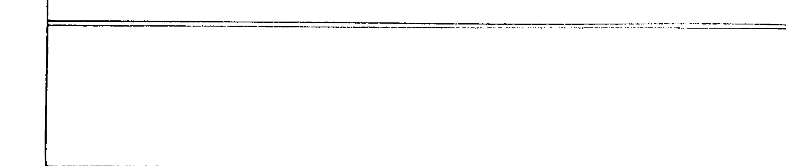

**Secondary evidence (uncertain mapping):**

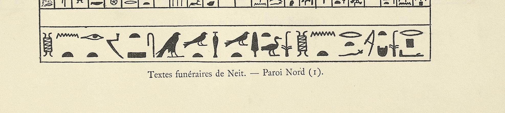

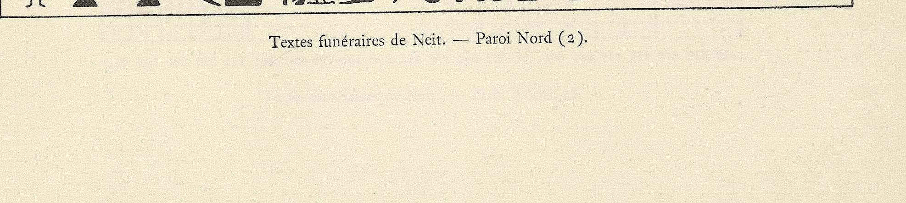

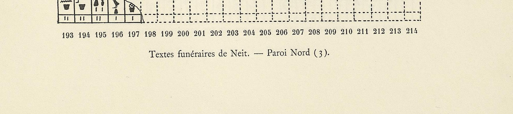

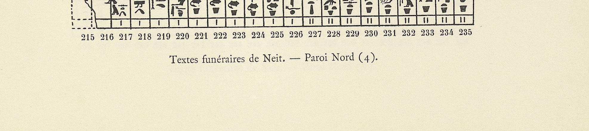

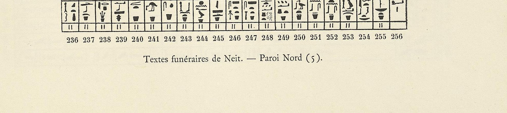

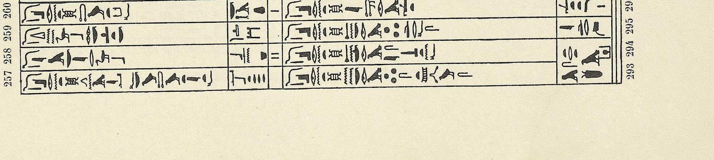

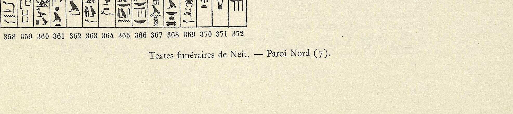

**Observation status:** Auto-annotated clusters 2 (manual review required).

**Cluster contact sheet:**

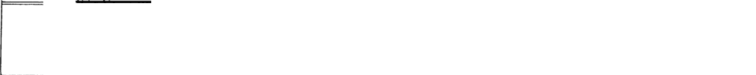

**Prior readings:**

- translation: mercer1952_sacred_texts/mercer1952_utt58_71 p.44
  text: O King, your father Atum comes to you; O King, your father Atum comes to you; O King, your father Atum comes to you. / O King, your mother Nut comes to you; O King, your mother Nut comes to you; O King, your mother Nut comes to you. / O King, your mother Nut comes to you.
  notes: Mercer translation, Utterance 63 lines 44a-44c (not in Nt.), via sacred-texts.com/egy/pyt/pyt05.htm.

**Reconstruction status:** No candidate readings generated without observations.

**Discrepancies:** None computed (no observed tokens).
